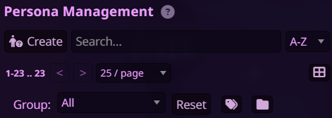

# Persona Groups Manager

A powerful extension for SillyTavern that allows you to organize your personas with custom groups and tags.

## Features

- 🏷️ Group Management: Organize personas into custom groups
- 📱 Mobile Friendly: Responsive design for all devices(I hope so...)
- 🎨 Theme Integration: Seamlessly integrates with SillyTavern themes
- 💾 Backup feature and support of SillyTavern persistent settings.

## Installation
Use ST's inbuilt extension installer.

##Usage

##Basic Setup
1. Open Persona Management in SillyTavern
2. Click the Tags button (🏷️) to enable group management mode
3. Click the Tags button on any persona card to open the group manager

### Managing Groups

- Add to Group: Check the box next to a group name
- Create New Group: Type a name in the input field and click "Add"
- Remove from Group: Uncheck the box next to a group name
- Filter by Group: Use the dropdown in the header to filter personas

### License
AGPL-3.0